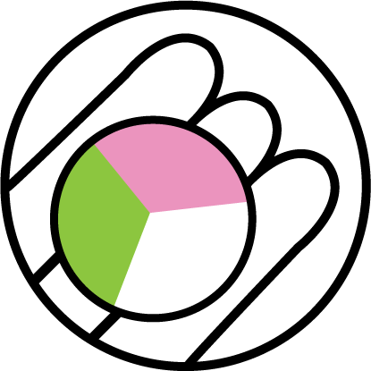

<p align="center">
  <br>
  
  <br>
</p>

<h2 align="center">
  <p>Salim Classifier</p>
</h2>

**วัตถุประสงค์:** ทุกวันนี้หาเพื่อนที่รักชาติ ศาสนา พระมหากษัตริย์ รัฐบาลยากเหลือเกิน มีแต่พวกสามกีบ ควายแดงคอยจ้องจะทำร้าย
ทางทีมของเราจึงสร้างโมเดลมาเพื่อช่วยหาเพื่อนสลิ่มจากคอมเม้น ที่นับวันจะหลงเหลืออยู่น้อยยิ่งนักในสังคมไทย ทั้งนี้เพื่อเป็นแนวทางในการสร้างสังคมสลิ่มที่แข็งแรงต่อไป

## วิธีการใช้งาน

สามารถลง `transfomers` จาก Huggingface และใช้งานโมเดลได้ดังต่อไปนี้

``` py
from transformers import AutoTokenizer, AutoModelForSequenceClassification, pipeline

# download model
tokenizer = AutoTokenizer.from_pretrained("tupleblog/salim-classifier")
model = AutoModelForSequenceClassification.from_pretrained("tupleblog/salim-classifier")

# using pipeline
classifier = pipeline("sentiment-analysis", model=model, tokenizer=tokenizer)
text = "จิตไม่ปกติ วันๆคอยแต่ให้คนเสี้ยมทะเลาะกันด่ากัน คอยจ้องแต่จะเล่นงานรัฐบาล ความคดด้านลบ"
classifier(text)
# >> [{'label': 'HIGHLY LIKELY SALIM', 'score': 0.9989368915557861}] ยินดีด้วย น่าจะเป็นสลิ่ม!
```

## การเก็บข้อมูล

เก็บข้อมูลจากเพจ Facebook ที่มีชาวสลิ่มเข้าไปคอมเม้น คัดเลือกชุดประโยคที่มีความยาวมากกว่า 50 ตัวอักษร
และทำการ Annotate จากนั้นนำข้อมูลมาเทรนโมเดลด้วย WangchanBERTa (ข้อมูลอาจมีความ bias เนื่องจากทางทีมงานเป็นผู้เก็บข้อมูลเอง)

## ทดลองใช้งานผ่าน HuggingFace

ท่านสามารถทดลองใช้งานผ่าน HuggingFace โดยใส่คอมเม้นจาก Facebook เข้าไปในช่องได้ในเว็บไซต์
[huggingface.co/tupleblog/salim-classifier](https://huggingface.co/tupleblog/salim-classifier)

ตัวอย่างประโยค
- รัฐรับผิดชอบทุกชีวิตไม่ได้หรอกคนให้บริการต้องจัดการเองถ้าจะเปิดผับบาร์

ทางทีมงานกำลังเขียนแอพพลิเคชั่นเพื่อให้สามารถนำไปใช้งานได้ง่ายยิ่งขึ้น
